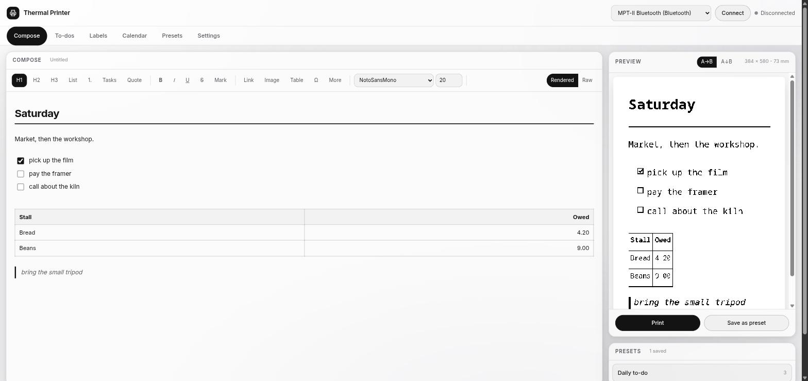
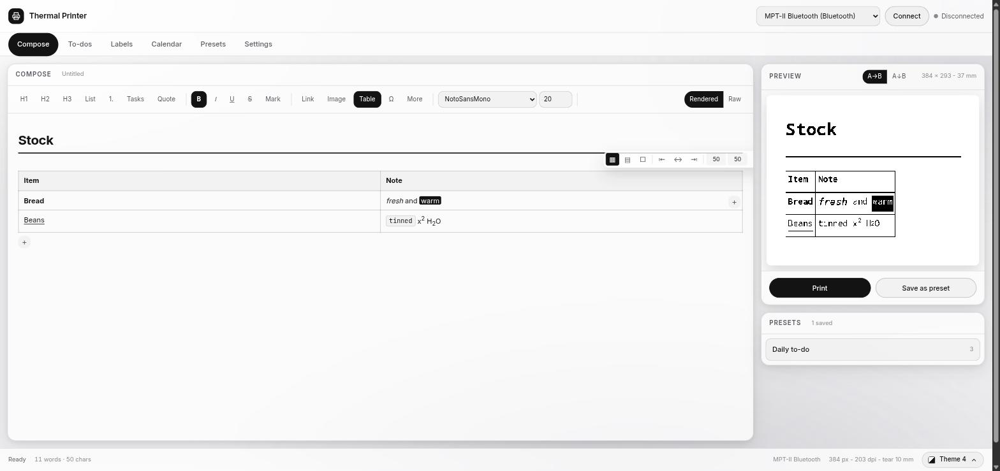
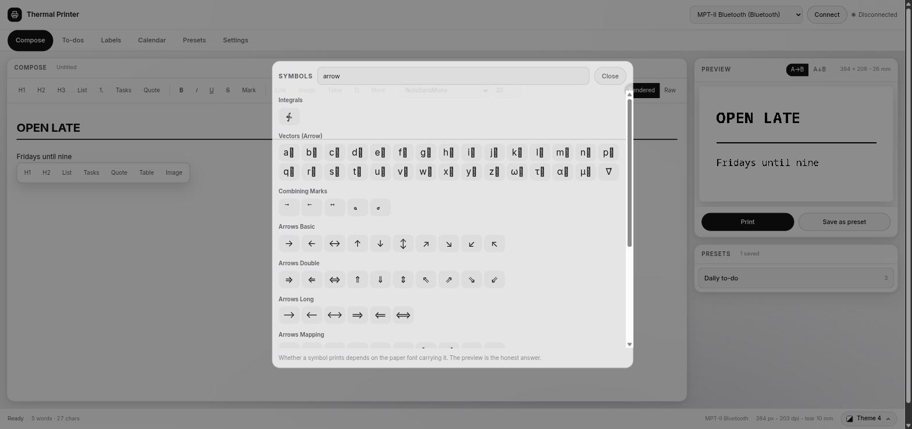
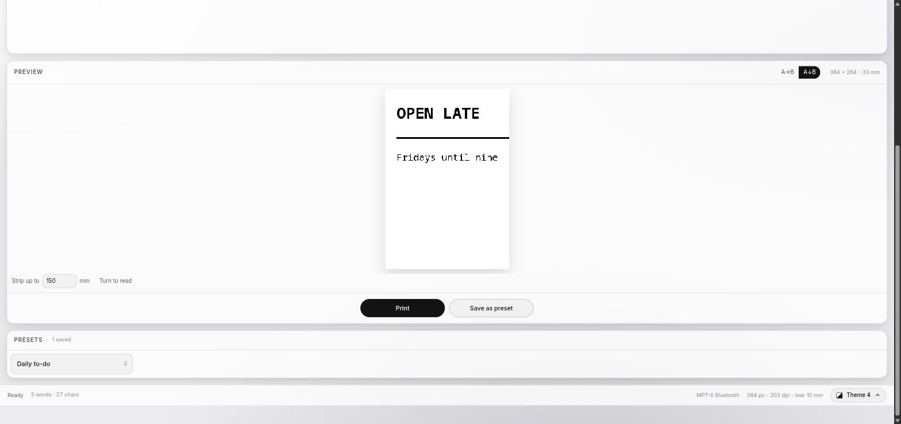
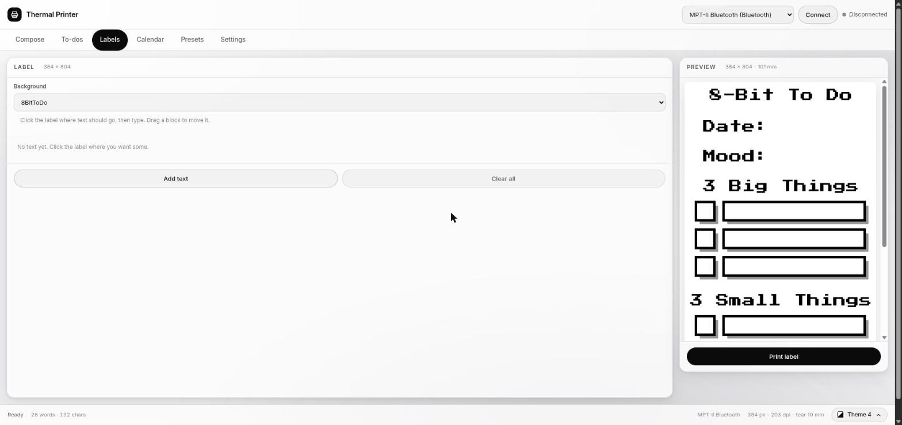
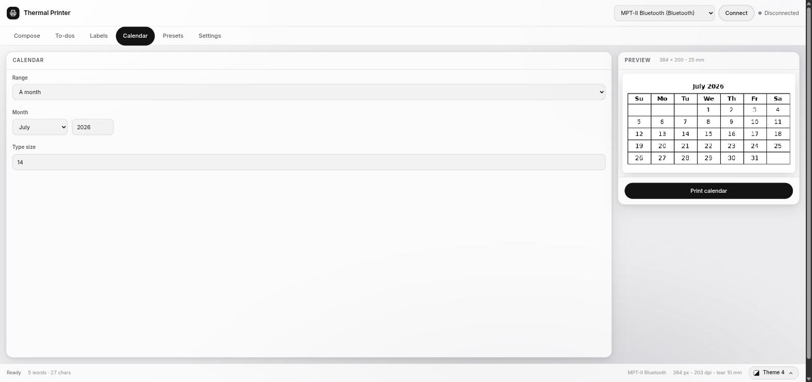
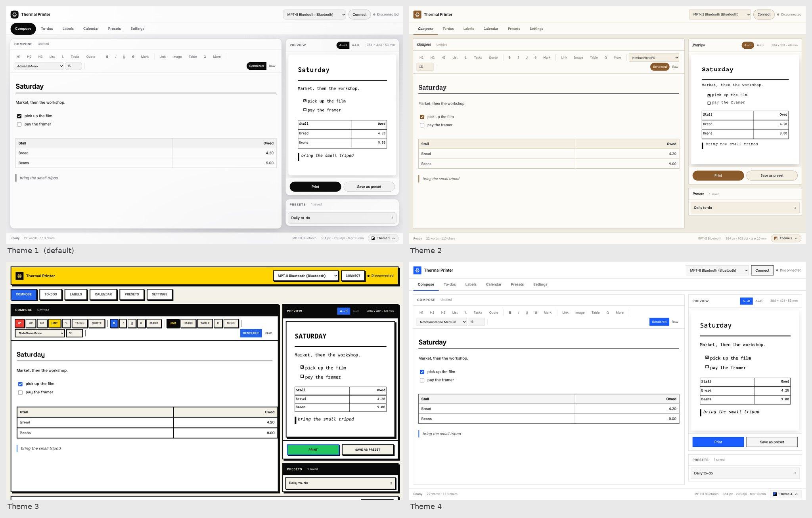
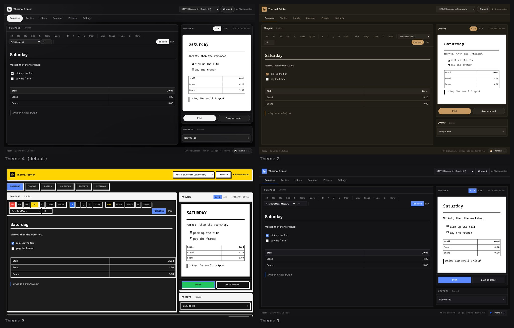

# Using it

Everything happens in the browser at <http://127.0.0.1:8760>. The tabs across
the top are the whole app: Compose, To-dos, Labels, Calendar, Presets,
Settings.

## The preview is the print

The preview is not a CSS impression of the page. It is the bitmap the print
head will receive, drawn by the same renderer that drives the printer, at 384
dots across and 203 dots per inch. If a glyph is missing from the paper font or
a table is too wide for the roll, the preview shows you before the paper does.

## Compose



Two editors over one document, and markdown is the document.

**Rendered** is a real editing surface, built on TipTap. A heading is a
heading, a quote has its bar, and a table is a table you type into. It is what
opens by default. **Raw** is the markdown itself in a plain textarea, for when
the source is what you want to see. Switching converts; either way markdown is
what gets previewed, printed and saved.

Toolbar buttons that can be on or off are toggles and light up when they are
on: Bold inside bold text removes it, H1 on a heading turns it back into a
paragraph. The ones with no off state, inserting a table, a rule or a picture,
never light up. Rarely used insertions live behind **More**.

### Tables



Put the caret in a table and its controls appear on the table itself: a plus at
the right edge adds a column, a plus under the bottom left adds a row, and
**Table** opens the properties panel with borders, column alignment, column
widths, and adding or deleting rows, columns and the table itself. Tab walks
the cells.

Columns are sized to their contents unless you say otherwise, both on screen
and on paper, so a two-column table stays narrow instead of stretching across
the roll. Set explicit widths in the panel and both follow them, wrapping cell
text rather than truncating it.

Alignment rides in the separator row, which is markdown's own syntax for it, so
any other reader of the file gets it too. Borders and column widths have no
markdown syntax, so they are written as a directive comment above the table:

```markdown
<!-- table borders=all widths=70,30 -->
| Item  | Note                  |
|:------|:----------------------|
| Bread | fresh from the market |
```

### Symbols



The Omega button opens a picker over nine hundred glyphs: mathematics, Greek,
arrows, set theory, shapes, units. Searching by name or by use ("integral",
"degree", "arrow") is faster than browsing, and browsing is there when you do
not have a name. Whether a symbol prints depends on the paper font carrying it,
and the preview is the honest answer.

### Pictures

The Image button uploads the file to the server, which stores it by content
hash under `~/.local/share/thermal-printer/images/` and hands back a reference
the document carries as ordinary markdown. At print time the renderer scales it
to the paper and screens it into dots, since a thermal head has one colour. An
image that cannot be loaded prints its alt text rather than leaving a hole.

Eleven screening methods are available. The diffusion kernels come from
dither-me-this, which states each one as offsets and factors over a common
divisor:

| Method | Suits |
|--------|-------|
| Threshold | line art, text, logos, anything already black and white |
| Ordered | an even, visibly patterned look |
| Sierra lite | fast and grainy |
| False Floyd-Steinberg | coarser and faster than the real one |
| Floyd-Steinberg | photographs, the usual default |
| Burkes | sharper than Floyd-Steinberg |
| Sierra two row | lighter than full Sierra |
| Sierra | smooth gradients |
| Jarvis-Judice-Ninke | smooth, with the error spread widest |
| Stucki | the finest detail, and the slowest |
| Atkinson | soft results, and the least ink on the paper |

Two sliders sit beside the method. **Cutoff** decides how much of the picture
becomes ink at all: it moves the whole picture towards paper or towards ink
before it is screened, so lower prints lighter and higher prints heavier. It is
applied to the tones rather than to the comparison point, because error
diffusion hands whatever it takes off one pixel to the next and so conserves
the average tone almost exactly. Simply moving the comparison point would leave
the slider doing nothing on nine of the eleven methods.

**Amount** decides how much of each pixel's error reaches its neighbours. At
100 percent it is the algorithm as published. Lower, the texture thins out and
the picture posterises into flatter areas, which is often easier to read on
paper. At zero it is a plain cutoff no matter which method is chosen.

Settings holds the defaults for all three. A single picture can override them
from the controls that appear when the picture is selected, and those choices
travel in markdown's own title slot, ``, so
they stay with the document and any other reader simply ignores them. Reset
puts the picture back on the page defaults.

## Direction



Normally a page is composed across the roll: 384 dots wide, as long as it
needs. **Along the roll** composes it the other way, on a strip as long as you
ask for and only as deep as the head is wide, then turns it a quarter turn so
the lines run down the paper. You get long lines and few of them, which suits a
banner, a label or a ticket. Anything deeper than the head is wide is trimmed
rather than scaled, since scaling would quietly change the size you chose, and
the preview says so when it happens rather than letting you find out on paper.

The choice sits in the preview head, next to what it changes, and Settings
keeps the default. Choosing **Along** rearranges Compose: the preview stops
being a column beside the editor and becomes a band underneath it, where a
strip wider than it is deep has room, and it is turned upright so you can read
it. **Turn to read** switches between that and the page as it actually comes
off the roll. Strip length is set in millimetres, which is how paper is sold;
the preview reports both the dots and the millimetres it will use.

The strip length is a maximum rather than an amount: it decides how much room a
line has before it runs out, and the blank end is cut off before printing, so a
two word banner on a 150 mm strip uses the few centimetres it needs instead of
feeding the lot. The end is given the same room the start has, and rules under
headings are cut back with everything else, since a rule running off past the
words looks like a mistake.

The head prints the full 48 mm width whatever is on it, so a strip shallower
than that leaves bare paper along one side. The page sits at the start of the
width and the spare paper follows it.

## Languages

Arabic, Hebrew and the other right to left scripts print properly: the text is
shaped and joined, the line runs from the right, and a bullet or a quote bar
goes on the right where the line begins. A document can mix directions freely,
paragraph by paragraph, and the editor lays each one out the way it reads.

The font you choose is used for Arabic too, whenever it can set it. Most
monospaced faces carry no Arabic at all, so choosing one of those changes the
English and leaves the Arabic looking the same: it has fallen back to a face
that has the script. Pick an Arabic face from the font list, such as Noto Naskh
Arabic, Noto Kufi Arabic or Amiri if you have it, and the Arabic changes with
it. The theme's `rtl_font` is what is tried after your choice.

**When that face is not enough**, the whole run moves to one that is. Quranic
annotation marks are the usual reason: the mono faces carry Arabic letters and
vowel marks but stop short of the pause marks, so a verse would otherwise print
with an empty box in the middle of it. The substitution is by run rather than
by character, since a joining script has to be set in one face, and it is
decided across the whole document so that two verses on a page never come out
in two different faces.

Left to right text is different: it does not join, so a character the page's
font has no glyph for is borrowed from another face on its own. That is what
keeps the symbol picker honest, since about a quarter of what it offers is
missing from the default printing font.

## Size

The font size in Settings and on the toolbar is the size of the *page*, not of
the selection: it sets the body size the whole receipt is composed at, and
headings scale from it. Emphasis within a document comes from the document,
through headings, bold, and the marks. Markdown has nowhere to record a size
for one run of text, and a receipt that changed size halfway through would not
survive being saved and reopened.

## To-dos

A list that persists, with its own preview and one tap to print. Click an item,
or its pencil, to change the wording: the tick keeps it, the cross or Escape
leaves it alone, and nothing is written until you say so.

It keeps its own **direction, font and size**, separately from Compose. Across
the roll is the usual way for a list. Along it is for the other case: one or
two things printed large down the length of the paper, big enough to read from
across the room and stuck where you cannot miss them. Match Compose puts the
face and size back to whatever the editor is using.

## Labels



A label is a printed background with your words placed on it. Choose a
background, click where the text should go, and type. Every block you place
carries a handle over the picture: it lights up under the pointer, along with
the line of the form it belongs to, and dragging it moves the block.
Coordinates are in the background's own pixels, so the same label prints the
same way whatever size the preview happens to be drawn at.

**Your own background.** Use a picture takes any image and keeps it beside the
three that ship, where it can be chosen like any of them and removed again. It
is used at its own size, so a background drawn at the head's width is one dot
to one pixel.

**Saving one.** A background and the blocks placed on it can be saved under a
name and opened again whole, which is what a label you print every week wants
to be. Saving over a name replaces it.

Shipped backgrounds live in `gallery/templates/`; your own go in
`~/.local/share/thermal-printer/labels/`, and saved labels in `labels.json`
beside them.

## Calendars



A month, or a week with room to write beside each day. Both are drawn at the
paper's width rather than set from markdown, so they are grids rather than
text, and the type size is yours to choose.

## Presets

A preset is a document you keep: it carries its own text, font, size, darkness
and direction, so a banner opens as a banner and a receipt opens as a receipt.
`{{date}}` and `{{time}}` are filled in when it prints.

## Themes



Four themes, each with light and dark, chosen from the switcher at the bottom
right. The choice is remembered, so the app comes back the way you left it. A theme sets the paper as much as the screen: the printing font, the
line spacing, and a set of typographic choices (headings in capitals, the
weight and style of rules, the bullet glyph, how table rows are separated, how
quotes are marked).

Choosing a font by hand pins it, and from then on theme changes leave the font
alone while the rest of the setting still follows the theme.



Your own themes go in `~/.local/share/thermal-printer/themes/`; see
[the theme guide](../web/static/themes/README.md).
